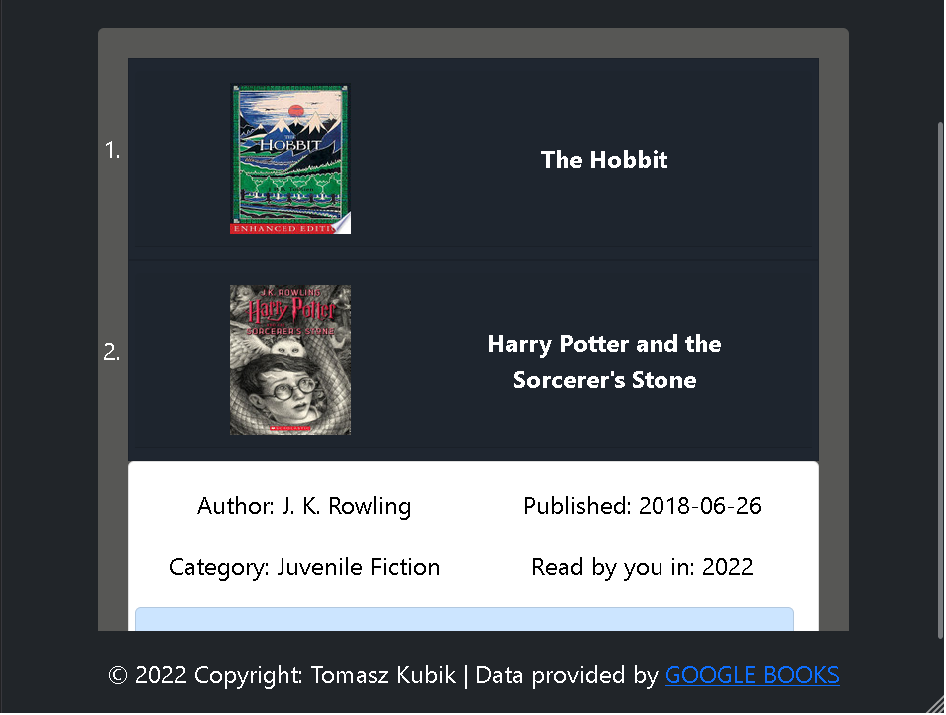

# Book Diary :book:

## Table of Contents

* [About](#about)
* [Features](#features)
* [Screenshots](#screenshots)
* [What I learned](#what-i-learned)

## About

**Book Diary** was my final project for [CS50's Introduction to Computer Science Course](https://www.edx.org/course/cs50s-introduction-to-computer-science).
**Book Diary** Let's you create personalized list of books you read :fireworks:

## Features

* create an account with using username and password
* add any book to list by yourself
* search and add books with live search bar
* add comments to your favourite books
* self updating books db
* view summary list
* random author's quote everyday
  
## Screenshots

* Home Page


* Log in Page

!Login](screenshots/login.png)

* Search for books


* Display list



## What I learned

I learned a lot of new things making this project. To complete it I used

* Python
* Flask
* JavaScript
* HTML
* CSS
* Bootstrap
* JQuery/Ajax
* API
* SQL databes

### Database and data structure

I decided to create self updating database using SQLite3.

```json
{
    "users": {
	"id": id,
	"username": username,
	"password": hashed_password
	}

    "books": {
	"book_id: id,
	"title": title,
	"author": author,
	"category": category,
	"published": publish_date,
	"cover_image" image_url
	}

    "user_books": {
	"user_id": user_id,
	"book_id": book_id,
	"finished_reading": finished_date
	}

    "comments": {
	"comment_id": comm_id,
	"user_id": user_id,
	"book_id": book_id,
	"text1": comm_str,
	"text2": comm_str,
	"text3": comm_str
	}
```
